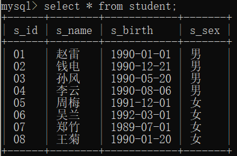
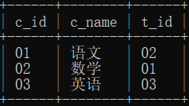
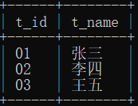
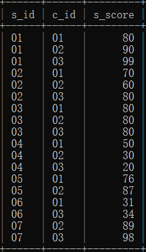

#### 概述
该数据库一共有四张表。

第一张为学生表，结构如下：
**Student (s_id, s_name, s_birth, s_sex)**
如图：



第二张为课程表
**Course(c_id, c_name, t_id)**



第三张为教师表
**Teacher(t_id, t_name)**



第四张为成绩表
**Score(s_id, c_id, score)**



****

#### 建表
```SQL
# 建表
# 学生表
CREATE TABLE `Student`(
    `s_id` VARCHAR(20),
    `s_name` VARCHAR(20) NOT NULL DEFAULT '',
    `s_birth` VARCHAR(20) NOT NULL DEFAULT '',
    `s_sex` VARCHAR(10) NOT NULL DEFAULT '',
    PRIMARY KEY(`s_id`)
);
# 课程表
CREATE TABLE `Course`(
    `c_id`  VARCHAR(20),
    `c_name` VARCHAR(20) NOT NULL DEFAULT '',
    `t_id` VARCHAR(20) NOT NULL,
    PRIMARY KEY(`c_id`)
);
# 师表
CREATE TABLE `Teacher`(
    `t_id` VARCHAR(20),
    `t_name` VARCHAR(20) NOT NULL DEFAULT '',
    PRIMARY KEY(`t_id`)
);
# 成绩表
CREATE TABLE `Score`(
    `s_id` VARCHAR(20),
    `c_id`  VARCHAR(20),
    `s_score` INT(3),
    PRIMARY KEY(`s_id`,`c_id`)
);
# 插入学生表测试数据
insert into Student values('01' , '赵雷' , '1990-01-01' , '男');
insert into Student values('02' , '钱电' , '1990-12-21' , '男');
insert into Student values('03' , '孙风' , '1990-05-20' , '男');
insert into Student values('04' , '李云' , '1990-08-06' , '男');
insert into Student values('05' , '周梅' , '1991-12-01' , '女');
insert into Student values('06' , '吴兰' , '1992-03-01' , '女');
insert into Student values('07' , '郑竹' , '1989-07-01' , '女');
insert into Student values('08' , '王菊' , '1990-01-20' , '女');
#课程表测试数据
insert into Course values('01' , '语文' , '02');
insert into Course values('02' , '数学' , '01');
insert into Course values('03' , '英语' , '03');

# 教师表测试数据
insert into Teacher values('01' , '张三');
insert into Teacher values('02' , '李四');
insert into Teacher values('03' , '王五');

#成绩表测试数据
insert into Score values('01' , '01' , 80);
insert into Score values('01' , '02' , 90);
insert into Score values('01' , '03' , 99);
insert into Score values('02' , '01' , 70);
insert into Score values('02' , '02' , 60);
insert into Score values('02' , '03' , 80);
insert into Score values('03' , '01' , 80);
insert into Score values('03' , '02' , 80);
insert into Score values('03' , '03' , 80);
insert into Score values('04' , '01' , 50);
insert into Score values('04' , '02' , 30);
insert into Score values('04' , '03' , 20);
insert into Score values('05' , '01' , 76);
insert into Score values('05' , '02' , 87);
insert into Score values('06' , '01' , 31);
insert into Score values('06' , '03' , 34);
insert into Score values('07' , '02' , 89);
insert into Score values('07' , '03' , 98);

```

###### 1、查询“01”课程比“02”课程成绩高的学生的信息以及课程分数
第一种方法——自连接
```SQL
select 
    c.*,
    a.s_score s01,
    b.s_score s02
from 
    score a, 
    score b, 
    student c
where 
    a.c_id = '01'
and 
    b.c_id = '02'
and 
    a.s_id = b.s_id
and 
    a.s_id = c.s_id
and 
    a.s_score > b.s_score;
```
第二种方法——长型数据变为宽型数据
```SQL
select 
    s.*,
    t.s01, 
    t.s02
from
    (select 
        a.s_id,
        max(case when a.c_id = '01' then a.s_score end) s01,
        max(case when a.c_id = '02' then a.s_score end) s02
    from 
        score a
    group by
        a.s_id) t, 
    Student s
where 
    t.s01 > t.s02
and 
    t.s_id = s.s_id;
```

****

###### 2、查询“01”课程比“02”课程成绩低的学生的信息以及课程分数
```SQL
select 
    s.*,
    t.s01, 
    t.s02
from
    (select 
        a.s_id,
        max(case when a.c_id = '01' then a.s_score end) s01,
        max(case when a.c_id = '02' then a.s_score end) s02
    from 
        score a
    group by
        a.s_id) t, 
    Student s
where 
    t.s01 < t.s02
and 
    t.s_id = s.s_id;
```

****

###### 3、查询平均成绩大于等于60分的同学的学生编号和学生姓名和平均成绩
子查询的方法
```SQL
select 
    s.s_id, 
    s.s_name, 
    t.score
from
    (select 
        s_id, 
        avg(s_score) score
    from 
        score
    group by 
        s_id) t, 
    student s
where
    t.s_id = s.s_id
and 
    t.score > 60;
```
两个表连接的方法
```SQL
select
    a.s_id, 
    s.s_name,
    avg(a.s_score) avg_s
from
    score a, 
    student s
where 
    a.s_id = s.s_id
group by 
    a.s_id
having 
    avg(a.s_score) >= 60;
```
****

###### 4、查询平均成绩小于60分的同学的学生编号和学生姓名和平均成绩
```SQL
select
    a.s_id, 
    s.s_name,
    avg(a.s_score) avg_s
from
    score a, 
    student s
where 
    a.s_id = s.s_id
group by 
    a.s_id
having 
    avg(a.s_score) < 60;
```
****

###### 5、查询所有同学的学生编号、学生姓名、选课总数、所有课程的总成绩

```SQL
select
    s.s_id,
    s.s_name,
    count(a.c_id) cnt_s, 
    ifnull(sum(a.s_score), 0) sum_s
from 
    score a
right join 
    student s
on 
    a.s_id = s.s_id
group by 
    a.s_id;
```

****

###### 6、查询“李”姓老师的数量
```SQL
select count(*) cnt_t
from teacher t
where t.t_name like '李%';
```

****

###### 7、查询学过张三老师授课的学生的信息
```SQL
select 
    c.*
from 
    course a, 
    score b, 
    student c, 
    teacher d
where 
    d.t_id = a.t_id
and 
    a.c_id = b.c_id
and 
    b.s_id = c.s_id
and 
    d.t_name = '张三';
```

****

###### 8、查询没学过张三老师授课的学生的信息
```SQL
select 
    * 
from
    student s
where 
    s.s_id 
not in
    (select 
        b.s_id
    from 
        course a, 
        score b, 
        teacher d
    where 
        d.t_id = a.t_id
    and 
        a.c_id = b.c_id
    and 
        d.t_name = '张三');
```

****

###### 9、查询学过编号为“01”并且也学过编号为“02”的课程的同学的信息

```SQL
select 
    c.*
from 
    score a, 
    score b, 
    student c
where 
    a.c_id = '01' 
and 
    b.c_id ='02'
and 
    a.s_id = b.s_id
and 
    a.s_id = c.s_id;
```

****

###### 10、查询学过编号为“01”但是没有学过编号为“02”的课程的同学的信息
```SQL
select 
    s.* 
from
    (select 
        a.s_id,
        max(case when a.c_id = '01' then a.s_score end) s01,
        max(case when a.c_id = '02' then a.s_score end) s02
    from 
        score a
    group by
        a.s_id) t, student s
where
    t.s_id = s.s_id
and 
    t.s01 is not null
and 
    t.s02 is null
```

****

###### 11、查询没有学全所有课程的同学的信息
```SQL
select 
    s.* 
from
    (select 
        a.s_id,
        max(case when a.c_id = '01' then a.s_score end) s01,
        max(case when a.c_id = '02' then a.s_score end) s02,
        max(case when a.c_id = '03' then a.s_score end) s03
    from 
        score a
    group by
        a.s_id
    having 
        s01 is null 
    or
        s02 is null 
    or
        s03 is null) t, 
        student s
where 
    s.s_id = t.s_id
```

****

###### 12、查询至少有一门课与学号01的同学所学相同的同学的信息
```SQL