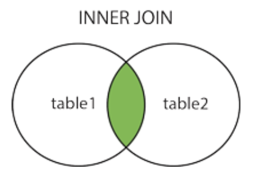
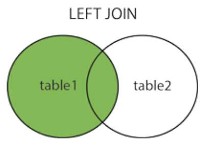
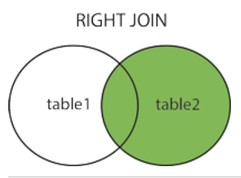

### MySQL教程
MySQL 是最流行的**关系型**数据库管理系统
#### 什么是数据库？
数据库（Database）是按照数据结构来组织、存储和管理数据的仓库。

所谓的关系型数据库，是建立在关系模型基础上的数据库，借助于集合代数等数学概念和方法来处理数据库中的数据。

RDBMS 即关系数据库管理系统(Relational Database Management System)的特点：

1. 数据以表格的形式出现
2. 每行为各种记录名称
3. 每列为记录名称所对应的数据域
4. 许多的行和列组成一张表单
5. 若干的表单组成database

#### RDBMS 术语
- 数据库: 数据库是数据表的集合。
- 数据表: 表是数据的矩阵。
- 列: 一列包含了相同类型的数据。
- 行：一行是一组相关的数据。
- 冗余：存储两倍数据，冗余降低了性能，但提高了数据的安全性。
- 主键：主键是唯一的。一个数据表中只能包含一个主键。你可以使用主键来查询数据。
- 外键：外键用于关联两个表。
- 复合键：复合键（组合键）将多个列作为一个索引键，一般用于复合索引。
- 索引：使用索引可快速访问数据库表中的特定信息。索引是对数据库表中一列或多列的值进行排序的一种结构。类似于书籍的目录。
- 参照完整性: 参照的完整性要求关系中不允许引用不存在的实体。与实体完整性是关系模型必须满足的完整性约束条件，目的是保证数据的一致性。

### MySQL 管理
#### 启动及关闭 MySQL 服务器
在 Windows 系统下，打开命令窗口(cmd)，进入 MySQL 安装目录的 bin 目录。

启动：
```
cd c:/mysql/bin
mysqld --console
```

关闭：
```
cd c:/mysql/bin
mysqladmin -uroot shutdown
```
#### MySQL 用户设置
如果你需要添加 MySQL 用户，你只需要在 mysql 数据库中的 user 表添加新用户即可。

以下为添加用户的的实例，用户名为guest，密码为guest123，并授权用户可进行 SELECT, INSERT 和 UPDATE操作权限：
```
root@host# mysql -u root -p
Enter password:*******
mysql> use mysql;
Database changed

mysql> INSERT INTO user 
          (host, user, password, 
           select_priv, insert_priv, update_priv) 
           VALUES ('localhost', 'guest', 
           PASSWORD('guest123'), 'Y', 'Y', 'Y');
Query OK, 1 row affected (0.20 sec)

mysql> FLUSH PRIVILEGES;
```

- 在 MySQL5.7 中 user 表的 password 已换成了authentication_string。
- password() 加密函数已经在 8.0.11 中移除了，可以使用 MD5() 函数代替。
- 执行 FLUSH PRIVILEGES 语句。 这个命令执行后会重新载入授权表。
- 在创建用户时为用户指定权限————在对应的权限列中，在插入语句中设置为 'Y' 即可。

另外一种添加用户的方法为通过SQL的 GRANT 命令，以下命令会给指定数据库TUTORIALS添加用户 zara ，密码为 zara123 。


#### 管理MySQL的命令

- USE 数据库名 ;
- SHOW DATABASES;
- SHOW TABLES;
- SHOW COLUMNS FROM 数据表;
- SHOW INDEX FROM 数据表;
- SHOW TABLE STATUS [FROM db_name] [LIKE 'pattern'] \G;

### MySQL 连接

#### 使用mysql二进制方式连接
```
[root@host]# mysql -u root -p
Enter password:******
//退出 mysql> 命令提示窗口可以使用 exit 命令，如下所示：
mysql> exit
Bye
```

### MySQL 创建数据库
#### 使用 create 命令创建数据库，语法如下:
```
CREATE DATABASE 数据库名;
[root@host]# mysql -u root -p   
Enter password:******  # 登录后进入终端
mysql> create DATABASE CCC;
```
#### 使用 mysqladmin 创建数据库
```
[root@host]# mysqladmin -u root -p create CCC
Enter password:******
```

### MySQL 删除数据库
#### drop 命令删除数据库
drop 命令格式：
```
drop database <数据库名>;
mysql> drop database CCC;
```
#### 使用 mysqladmin 删除数据库
```
[root@host]# mysqladmin -u root -p drop CCC
Enter password:******
```

### MySQL 选择数据库
```
[root@host]# mysql -u root -p
Enter password:******
mysql> use CCC;
Database changed
mysql>
```
### MySQL 数据类型

MySQL数据类型，可以分为：数值、日期/时间和字符串(字符)类型。

#### 数值类型
严格数值数据类型(INTEGER、SMALLINT、DECIMAL和NUMERIC)
近似数值数据类型(FLOAT、REAL和DOUBLE PRECISION)。


#### 日期和时间类型
表示时间值的日期和时间类型为DATETIME、DATE、TIMESTAMP、TIME和YEAR。

每个时间类型有一个有效值范围和一个"零"值，当指定不合法的MySQL不能表示的值时使用"零"值。
#### 字符串类型
字符串类型指CHAR、VARCHAR、BINARY、VARBINARY、BLOB、TEXT、ENUM和SET。

### MySQL 创建数据表
创建MySQL数据表需要以下信息：

- 表名
- 表字段名
- 定义每个表字段
**语法**
以下为创建MySQL数据表的SQL通用语法：
```
CREATE TABLE table_name (column_name column_type);
```

#### 通过命令提示符创建表
```
root@host# mysql -u root -p
Enter password:*******
mysql> use RUNOOB;
Database changed
mysql> CREATE TABLE runoob_tbl(
   -> runoob_id INT NOT NULL AUTO_INCREMENT,
   -> runoob_title VARCHAR(100) NOT NULL,
   -> runoob_author VARCHAR(40) NOT NULL,
   -> submission_date DATE,
   -> PRIMARY KEY ( runoob_id )
   -> )ENGINE=InnoDB DEFAULT CHARSET=utf8;

```
### MySQL 删除数据表

以下为删除MySQL数据表的通用语法：
```
DROP TABLE table_name ;
```
```
root@host# mysql -u root -p
Enter password:*******
mysql> use RUNOOB;
Database changed
mysql> DROP TABLE runoob_tbl
Query OK, 0 rows affected (0.8 sec)
mysql>
```

### MySQL插入数据
使用 INSERT INTO SQL语句来插入数据。

以下为向MySQL数据表插入数据通用的 INSERT INTO SQL语法：
```
INSERT INTO table_name ( field1, field2,...fieldN )
                       VALUES
                       ( value1, value2,...valueN );
```
```
root@host# mysql -u root -p password;
Enter password:*******
mysql> use RUNOOB;
Database changed
mysql> INSERT INTO runoob_tbl 
    -> (runoob_title, runoob_author, submission_date)
    -> VALUES
    -> ("学习 PHP", "菜鸟教程", NOW());
mysql> INSERT INTO runoob_tbl
    -> (runoob_title, runoob_author, submission_date)
    -> VALUES
    -> ("学习 MySQL", "菜鸟教程", NOW());
mysql> INSERT INTO runoob_tbl
    -> (runoob_title, runoob_author, submission_date)
    -> VALUES
    -> ("JAVA 教程", "RUNOOB.COM", '2016-05-06');
```

### MySQL 查询数据
以下为在MySQL数据库中查询数据通用的 SELECT 语法：
```
SELECT column_name,column_name
FROM table_name
[WHERE Clause]
[LIMIT N][ OFFSET M]
```

- 查询语句中你可以使用一个或者多个表，表之间使用逗号(,)分割，并使用WHERE语句来设定查询条件。
- SELECT 命令可以读取一条或者多条记录。
- 使用星号（*）来代替其他字段，SELECT语句会返回表的所有字段数据
- 使用 WHERE 语句来包含任何条件。
- 使用 LIMIT 属性来设定返回的记录数。
- 通过OFFSET指定SELECT语句开始查询的数据偏移量。默认情况下偏移量为0。

### MySQL WHERE 子句
以下是 SQL SELECT 语句使用 WHERE 子句从数据表中读取数据的通用语法：

SELECT field1, field2,...fieldN FROM table_name1, table_name2...
[WHERE condition1 [AND [OR]] condition2.....

- 查询语句中你可以使用一个或者多个表，表之间使用逗号, 分割，并使用WHERE语句来- 设定查询条件。
- 可以在 WHERE 子句中指定任何条件。
- 可以使用 AND 或者 OR 指定一个或多个条件。
- WHERE 子句也可以运用于 SQL 的 DELETE 或者 UPDATE 命令。
- WHERE 子句类似于程序语言中的 if 条件，根据 MySQL 表中的字段值来读取指定的数据。

### MySQL UPDATE 更新
以下是 UPDATE 命令修改 MySQL 数据表数据的通用 SQL 语法：
```
UPDATE table_name SET field1=new-value1, field2=new-value2
[WHERE Clause]
```
- 可以同时更新一个或多个字段。
- 可以在 WHERE 子句中指定任何条件。
- 可以在一个单独表中同时更新数据。

### MySQL DELETE 语句
以下是 SQL DELETE 语句从 MySQL 数据表中删除数据的通用语法：
```
DELETE FROM table_name [WHERE Clause]
```
- 没有指定 WHERE 子句，MySQL 表中的所有记录将被删除。
- 可以在 WHERE 子句中指定任何条件
- 可以在单个表中一次性删除记录。

```
mysql> use RUNOOB;
Database changed
mysql> DELETE FROM runoob_tbl WHERE runoob_id=3;
```
### MySQL LIKE 子句

SQL SELECT 语句使用 LIKE 子句从数据表中读取数据的通用语法：
```
SELECT field1, field2,...fieldN 
FROM table_name
WHERE field1 LIKE condition1 [AND [OR]] filed2 = 'somevalue'
```

```
mysql> use RUNOOB;
Database changed
mysql> SELECT * from runoob_tbl  WHERE runoob_author LIKE '%COM';
```

### MySQL UNION 操作符

MySQL UNION 操作符用于连接两个以上的 SELECT 语句的结果组合到一个结果集合中。多个 SELECT 语句会删除重复的数据。
语法：
```
SELECT expression1, expression2, ... expression_n
FROM tables
[WHERE conditions]
UNION [ALL | DISTINCT]
SELECT expression1, expression2, ... expression_n
FROM tables
[WHERE conditions];
```

- expression1, expression2, ... expression_n: 要检索的列。

- tables: 要检索的数据表。

- WHERE conditions: 可选， 检索条件。

- DISTINCT: 可选，删除结果集中重复的数据。默认情况下 UNION 操作符已经删除了重复数据，所以 DISTINCT 修饰符对结果没啥影响。

- ALL: 可选，返回所有结果集，包含重复数据。

#### SQL UNION 实例
下面的 SQL 语句从 "Websites" 和 "apps" 表中选取所有不同的country（只有不同的值）：
```
SELECT country FROM Websites
UNION
SELECT country FROM apps
ORDER BY country;
```

### MySQL 排序
从 MySQL 表中使用 SQL SELECT 语句来读取数据，使用 MySQL 的 ORDER BY 子句来排序
语法：
以下是 SQL SELECT 语句使用 ORDER BY 子句将查询数据排序后再返回数据：
```
SELECT field1, field2,...fieldN FROM table_name1, table_name2...
ORDER BY field1 [ASC [DESC][默认 ASC]], [field2...] [ASC [DESC][默认 ASC]]
```

### MySQL GROUP BY 语句
GROUP BY 语句根据一个或多个列对结果集进行分组。

在分组的列上我们可以使用 COUNT, SUM, AVG,等函数。
```
SELECT column_name, function(column_name)
FROM table_name
WHERE column_name operator value
GROUP BY column_name;
```

使用 GROUP BY 语句 将数据表按名字进行分组，并统计每个人有多少条记录：
```
mysql> SELECT name, COUNT(*) FROM   employee_tbl GROUP BY name;
+--------+----------+
| name   | COUNT(*) |
+--------+----------+
| 小丽 |        1 |
| 小明 |        3 |
| 小王 |        2 |
+--------+----------+
```
#### 使用 WITH ROLLUP
WITH ROLLUP 可以实现在分组统计数据基础上再进行相同的统计（SUM,AVG,COUNT…）。
```
mysql> SELECT name, SUM(singin) as singin_count FROM  employee_tbl GROUP BY name WITH ROLLUP;
``` 
### MySQL 连接的使用

JOIN 按照功能大致分为如下三类：

- INNER JOIN（内连接,或等值连接）：获取两个表中字段匹配关系的记录。
- LEFT JOIN（左连接）：获取左表所有记录，即使右表没有对应匹配的记录。
- RIGHT JOIN（右连接）： 与 LEFT JOIN 相反，用于获取右表所有记录，即使左表没有对应匹配的记录。
```
mysql> SELECT a.runoob_id, a.runoob_author, b.runoob_count FROM runoob_tbl a INNER JOIN tcount_tbl b ON a.runoob_author = b.runoob_author;
```
等价于WHERE子句
```
mysql> SELECT a.runoob_id, a.runoob_author, b.runoob_count FROM runoob_tbl a, tcount_tbl b WHERE a.runoob_author = b.runoob_author;
```
内连接

左连接

右连接


### MySQL NULL 值处理
一般用在WHERE子句中
1. IS NULL: 当列的值是 NULL,此运算符返回 true。
2. IS NOT NULL: 当列的值不为 NULL, 运算符返回 true。
3. <=>: 比较操作符（不同于 = 运算符），当比较的的两个值相等或者都为 NULL 时返回 true。

### MySQL 正则表达式

MySQL中使用 REGEXP 操作符来进行正则表达式匹配。


### MySQL 事务
在人员管理系统中，你删除一个人员，你既需要删除人员的基本资料，也要删除和该人员相关的信息，如信箱，文章等等，这样，这些数据库操作语句就构成一个事务！

在 MySQL 中只有使用了 Innodb 数据库引擎的数据库或表才支持事务。
事务处理可以用来维护数据库的完整性，保证成批的 SQL 语句要么全部执行，要么全部不执行。
事务用来管理 insert,update,delete 语句
一般来说，事务是必须满足4个条件（ACID）：：原子性（Atomicity，或称不可分割性）、一致性（Consistency）、隔离性（Isolation，又称独立性）、持久性（Durability）。

原子性：一个事务（transaction）中的所有操作，要么全部完成，要么全部不完成，不会结束在中间某个环节。事务在执行过程中发生错误，会被回滚（Rollback）到事务开始前的状态，就像这个事务从来没有执行过一样。

一致性：在事务开始之前和事务结束以后，数据库的完整性没有被破坏。这表示写入的资料必须完全符合所有的预设规则，这包含资料的精确度、串联性以及后续数据库可以自发性地完成预定的工作。

隔离性：数据库允许多个并发事务同时对其数据进行读写和修改的能力，隔离性可以防止多个事务并发执行时由于交叉执行而导致数据的不一致。事务隔离分为不同级别，包括读未提交（Read uncommitted）、读提交（read committed）、可重复读（repeatable read）和串行化（Serializable）。

持久性：事务处理结束后，对数据的修改就是永久的，即便系统故障也不会丢失。

#### MYSQL 事务处理主要有两种方法：
##### 用 BEGIN, ROLLBACK, COMMIT来实现

BEGIN 开始一个事务
ROLLBACK 事务回滚
COMMIT 事务确认
##### 直接用 SET 来改变 MySQL 的自动提交模式:

SET AUTOCOMMIT=0 禁止自动提交
SET AUTOCOMMIT=1 开启自动提交

### MySQL ALTER命令
当我们需要修改数据表名或者修改数据表字段时，就需要使用到MySQL ALTER命令。

#### 删除，添加或修改表字段
如下命令使用了 ALTER 命令及 DROP 子句来删除以上创建表的 i 字段：
```
mysql> ALTER TABLE testalter_tbl  DROP i;
```
如果数据表中只剩余一个字段则无法使用DROP来删除字段。

MySQL 中使用 ADD 子句来向数据表中添加列，如下实例在表 testalter_tbl 中添加 i 字段，并定义数据类型:
```
mysql> ALTER TABLE testalter_tbl ADD i INT;
```
执行以上命令后，i 字段会自动添加到数据表字段的末尾。

#### 修改字段类型及名称
如果需要修改字段类型及名称, 你可以在ALTER命令中使用 MODIFY 或 CHANGE 子句 。

例如，把字段 c 的类型从 CHAR(1) 改为 CHAR(10)，可以执行以下命令:
```
mysql> ALTER TABLE testalter_tbl MODIFY c CHAR(10);
```

#### 修改字段默认值
你可以使用 ALTER 来修改字段的默认值，尝试以下实例：
```
mysql> ALTER TABLE testalter_tbl ALTER i SET DEFAULT 1000;
mysql> SHOW COLUMNS FROM testalter_tbl;
```
你也可以使用 ALTER 命令及 DROP子句来删除字段的默认值，如下实例：
```
mysql> ALTER TABLE testalter_tbl ALTER i DROP DEFAULT;
mysql> SHOW COLUMNS FROM testalter_tbl;
```
#### 修改表名
如果需要修改数据表的名称，可以在 ALTER TABLE 语句中使用 RENAME 子句来实现。

```
mysql> ALTER TABLE testalter_tbl RENAME TO alter_tbl;
```

### 


